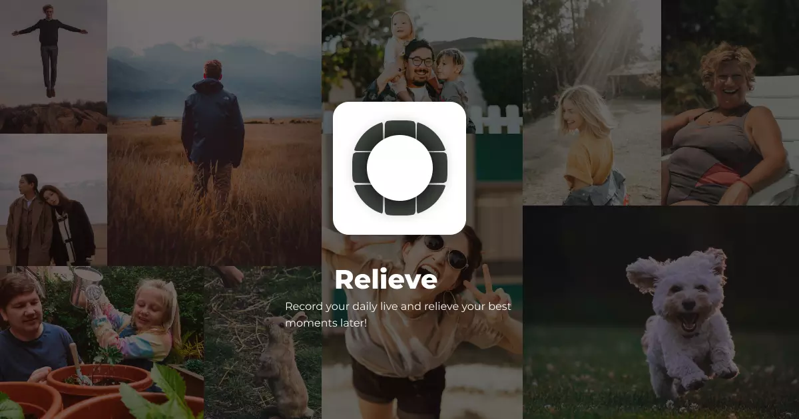

# Relieve

## What did I do today?

Find out what you did all these days and unlock moments you completely forgot!

## Showcase

### Available for Android

    
    
    
    
    
    

### As well as for iOS!

    
    
    
    
    

## App checkup

* :heart: Created using Flutter
* :apple: Native behavior on Android & iOS
* :white_check_mark: Tested on multiple real devices
* :u7a7a: Completely localized (available in English & German)
* :new_moon_with_face: Supports dark mode
* :fast_forward: Optimized for efficient behavior
* :iphone: Includes self-written native modules
* :earth_africa: Uses OpenStreetMap on Android for more privacy; Uses Apple Maps on iOS devices
* :star: Uses animations for awesome User Experience

## Note regarding the original app

The original app to Relieve is [Quid Faciam Hodie?](https://github.com/Myzel394/quid_faciam_hodie). This app was submitted as part of the [Supabase Hackathon 2022](https://supabase.com/blog/launch-week-5-hackathon). This app isn't maintained anymore. Relieve doesn't rely on Supabase and will be maintained.
